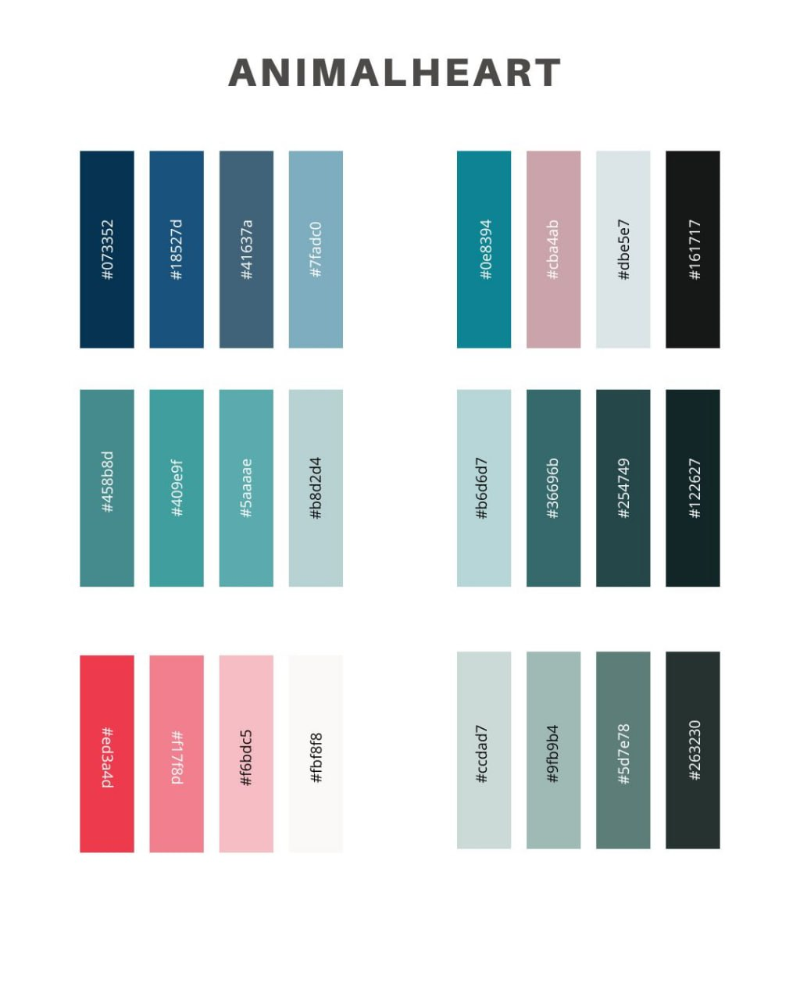
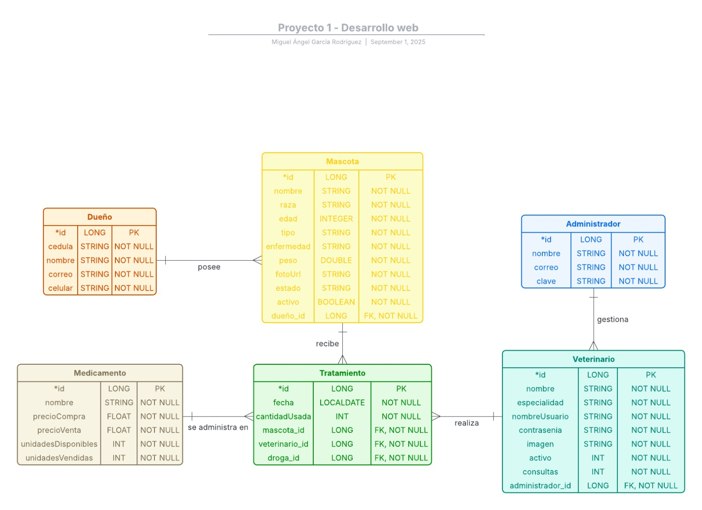
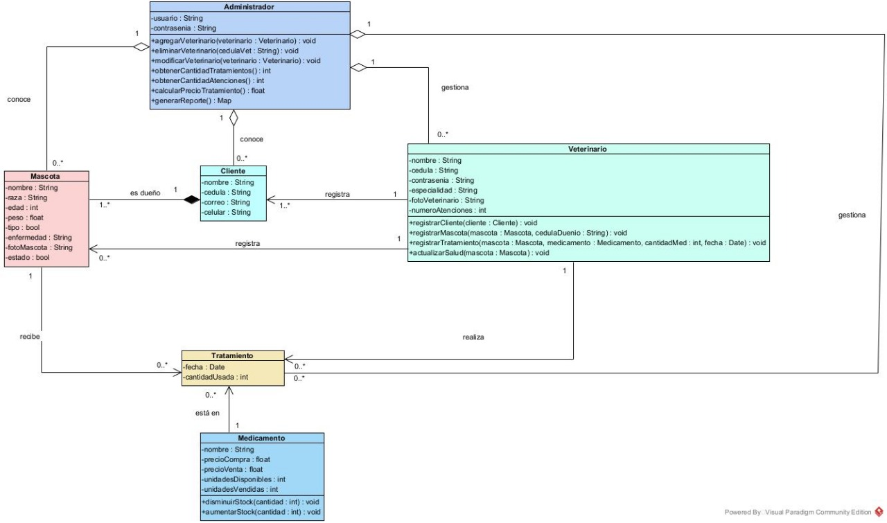

# AnimalHeart 🐾

  

Aplicativo web desarrollado para la gestión digital de una clínica veterinaria, permitiendo el control de pacientes, tratamientos y personal médico.

## 🚀 Características

- **Portal de clientes**: Seguimiento del estado de mascotas hospitalizadas
- **Portal veterinario**: Registro de atenciones médicas y administración de tratamientos
- **Portal administrativo**: Dashboard con métricas del negocio y gestión de personal
- **Sistema de roles**: Control de acceso diferenciado para clientes, veterinarios y administradores

## 🛠️ Tecnologías Utilizadas

- **Backend**: Spring Boot, Spring Security, Spring Data JPA
- **Frontend**: Thymeleaf, HTML, CSS
- **Diseño**: Figma (prototipos y mockups)
- **Control de versiones**: Git/GitHub

## 🎨 Paleta de Colores

 `#858b8d` 
 `#405e9f` 
 `#458b8d`  
 `#18527d`  
 `#fb6d65`   
 `#cba4ab` 
 `#dbeb87`  
 `#161717`

  

## ⚙️ Roles de Usuario
- **Cliente**: Consulta estado de sus mascotas e historial de tratamientos.
- **Veterinario**: Registra tratamientos y mascotas. Administra la información de la mascota, es decir, sus tratamientos y sus diagnósticos.
- **Administrador**: Gestiona el personal médico, visualiza las métricas y superviza operaciones.

## Diagramas de relación

  

  

